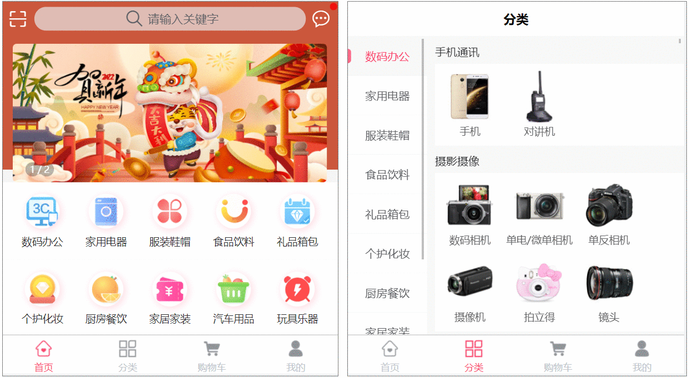
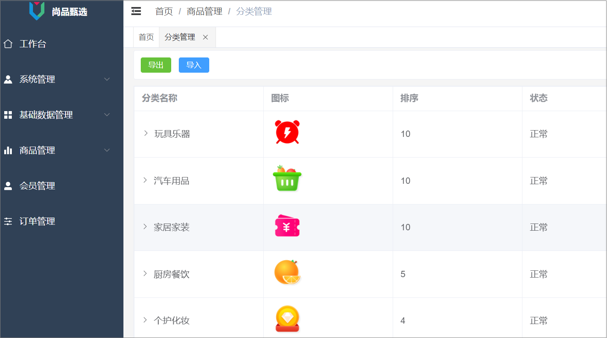
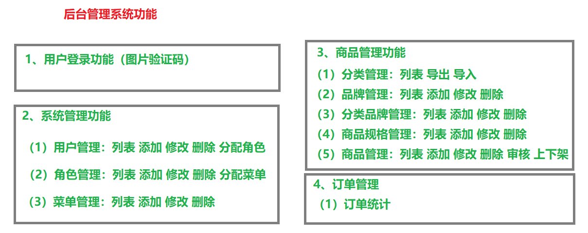
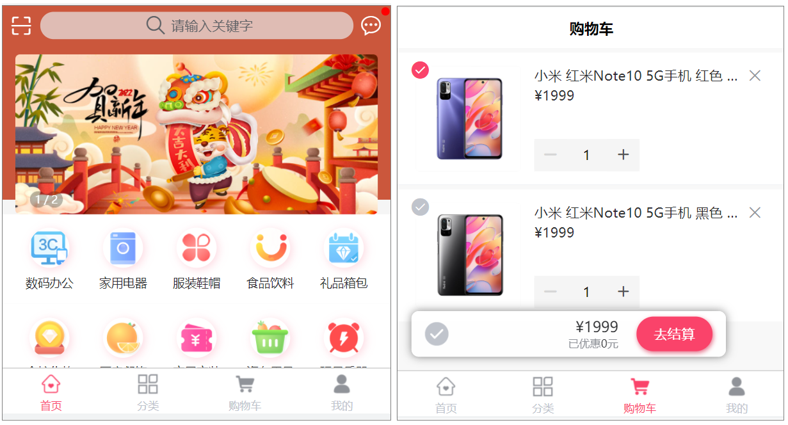
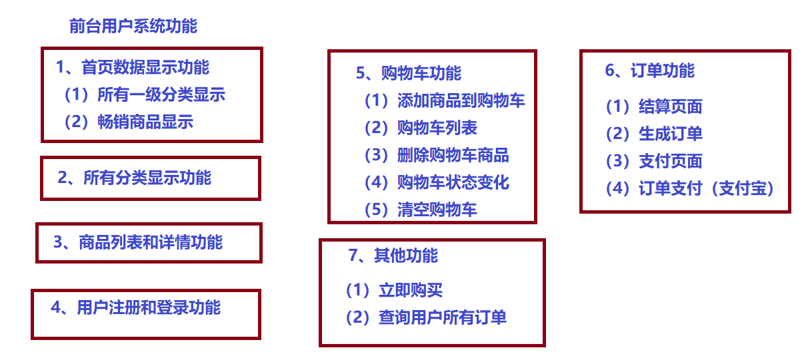
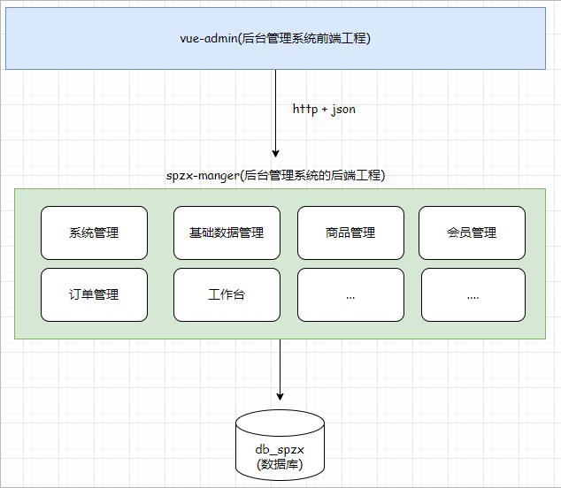
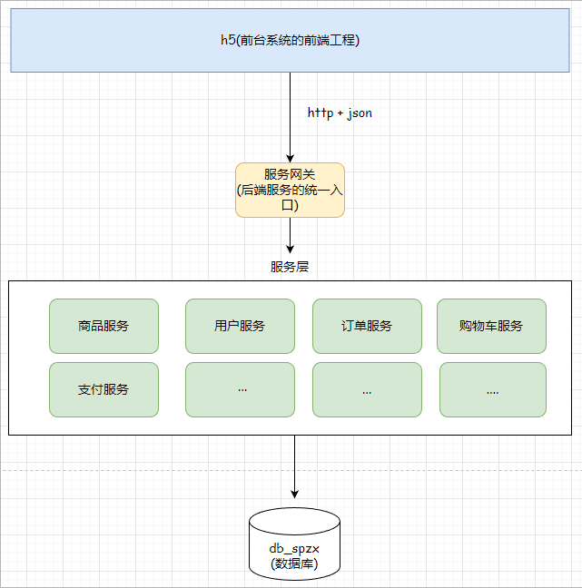

# SpringBoot-SpringCloud--Shangpin-Selection

一个电子商务平台

## 项目简介

项目采用B2C模式，使用SpringBoot+SpringCloud微服务架构，采用前后端分离开发模式。项目包含两个系统：**后台管理系统** 和 **前台用户系统（手机端）**，采用模块化设计，代码结构清晰，注重用户体验与界面美观。

- **项目使用技术栈**
  
**后端：** Spring Boot、Spring Cloud Alibaba、Redis、EasyExcel、Minio、短信平台、支付宝支付等

**前端：** Vue3、ES6、Node.js、NPM、Element Plus、ECharts等

- **项目前后台演示**

## 项目功能

### 业务功能介绍

- **后台管理系统功能**
  
平台管理员用来维护系统相关的基础数据。包含用户登录、权限管理、商品管理、商品分类管理、商品规格管理、订单管理等

- **前台用户系统功能**

 包含首页数据显示，分类显示、查询商品数据、用户注册登录、购物车模块、订单模块等

 
 
 

### 系统架构介绍

后端项目模块继承关系图
 

后台管理系统后端采用的是单体架构【就是把所有的功能写在同一个项目中】
 

前台用户系统的后端采用的是微服务系统架构【一个模块就是一个独立服务】
 

